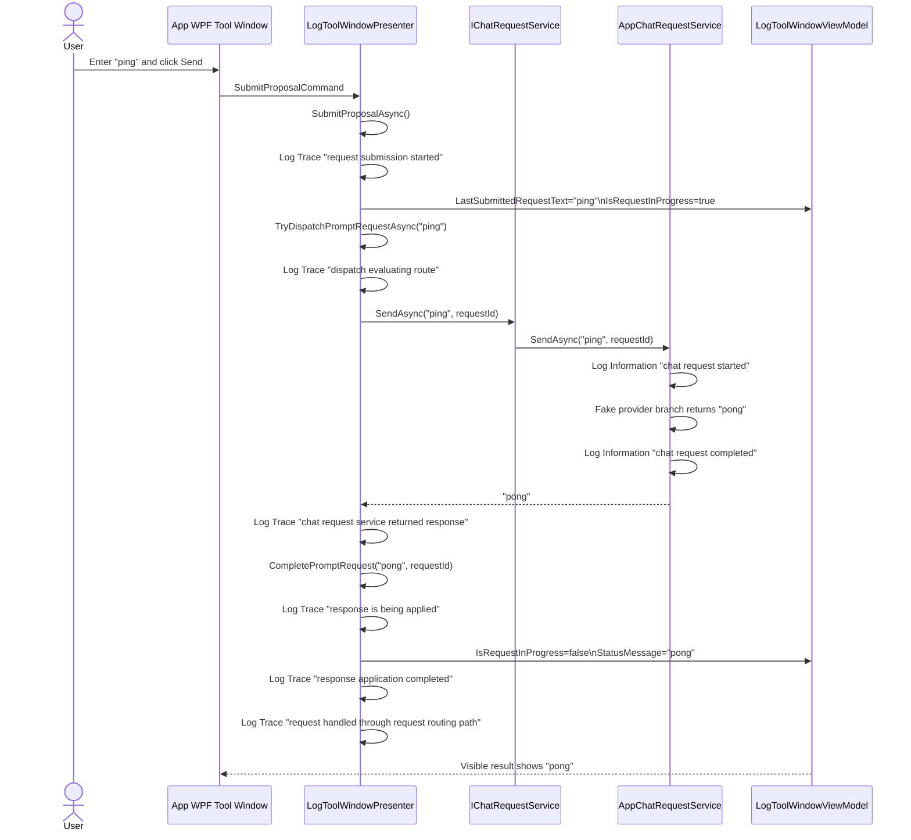

# App Host Ping Trace Workflow

Use this workflow to repeat the observed end-to-end `ping` validation against `VsMcpBridge.App`, capture durable artifacts, and compare the resulting sequence against the current code.

## Purpose

Provide a repeatable AI-friendly and developer-friendly process for:

- launching the standalone App host
- exercising the live WPF request surface with `ping`
- collecting the visible result and correlated logs
- generating a Mermaid sequence diagram from observed behavior
- comparing the observed sequence to the current code path
- producing durable artifacts that can be reused in later sessions and future developer-facing explanations

## Scope

This workflow documents the App-host path only.

It does not prove the VSIX runtime path directly. If a future session needs the VSIX path, produce a separate validation run and a separate diagram.

## Preconditions

- repository root: `Y:\vs-mcp-bridge`
- branch should be recorded before the run
- `VsMcpBridge.App/appsettings.json` should enable diagnostic logging:
  - `VsMcpBridge:Logging:Provider = StdErr`
  - `VsMcpBridge:Logging:MinimumLevel = Trace`
- chat provider should be recorded before the run:
  - `Adventures:ChatEngine:Provider = Fake`
  - `Adventures:ChatEngine:OpenAI:UseRealApi = false`

## Observed Baseline Run

This workflow was validated on:

- date: `2026-05-07`
- branch: `feature/approval-apply-ui-slice`
- commit: `2ed6e93`
- host: `VsMcpBridge.App`
- provider: `Fake`
- prompt: `ping`
- expected visible result: `pong`
- observed correlation id: `6c4940351f3a436da5392a3c7092b98e`

Reference artifacts from this baseline run:

- sequence diagram: [`SolutionFolder/docs/diagrams/app-host-ping-trace-20260507.mmd`](diagrams/app-host-ping-trace-20260507.mmd)
- observed log transcript: [`SolutionFolder/artifacts/logs/app-host-ping-trace-20260507.log`](../artifacts/logs/app-host-ping-trace-20260507.log)
- run metadata: [`SolutionFolder/artifacts/logs/app-host-ping-trace-20260507.metadata.json`](../artifacts/logs/app-host-ping-trace-20260507.metadata.json)
- developer-facing summary: [`SolutionFolder/docs/blog-drafts/app-host-ping-trace-walkthrough-20260507.md`](blog-drafts/app-host-ping-trace-walkthrough-20260507.md)

## Run Procedure

### 1. Launch the App host

From the repository root:

```powershell
Set-Location 'Y:\vs-mcp-bridge'
dotnet run --project .\VsMcpBridge.App\VsMcpBridge.App.csproj
```

Expected startup evidence:

- the `VS MCP Bridge` window becomes visible
- the log surface contains initialization lines
- the log surface includes a trace line similar to:

```text
[Trace] [VsMcpBridge] Waiting for pipe client connection on 'VsMcpBridge'.
```

### 2. Exercise the prompt surface

In the App window:

1. enter `ping` in the request input box
2. click `Send`
3. wait for `IsRequestInProgress` to clear and the visible result surface to update

Expected visible results:

- the last submitted request shows `ping`
- the visible result surface shows `pong`
- the log panel shows correlated presenter and host-service entries with the same `RequestId`

### 3. Capture artifacts

Copy or save the following:

- UI log text from the log surface
- visible request/result values
- runtime configuration snapshot for logging and chat provider settings
- branch and commit information

Suggested durable outputs:

- `SolutionFolder/artifacts/logs/<run-name>.log` for trimmed observed logs
- `SolutionFolder/artifacts/logs/<run-name>.metadata.json` for environment and config metadata
- `SolutionFolder/docs/diagrams/<run-name>.mmd` for the Mermaid sequence
- `SolutionFolder/docs/blog-drafts/<run-name>.md` for a short developer-facing explanation when the run establishes or updates a durable understanding

## Expected Log Pattern

For the App-host fake-provider ping path, the expected sequence is:

1. `Prompt-box request submission started`
2. `Prompt-box request dispatch evaluating route`
3. `Prompt-box request routed to chat request service`
4. `App chat request started`
5. `App chat request completed`
6. `Prompt-box chat request service returned response`
7. `Prompt-box response is being applied to the visible UI state`
8. `Prompt-box response application completed`
9. `Prompt-box request handled through request routing path`

Every line in the observed request flow should carry the same correlation id.

## Mermaid Generation Pattern

Build the Mermaid sequence from the observed logs, not from memory.

Use this template and replace the participants or labels only when the observed path differs:



## Code Comparison Checklist

After generating the sequence, compare it to the current code.

### Presenter checkpoints

Confirm these methods still match the observed order:

- `LogToolWindowPresenter.SubmitProposalAsync`
- `LogToolWindowPresenter.TryDispatchPromptRequestAsync`
- `LogToolWindowPresenter.CompletePromptRequest`

Specific expectations:

- a request id is created before routing
- the request id is reused in all presenter Trace lines for that flow
- non-built-in prompts route through `IChatRequestService.SendAsync(message, requestId)`
- the presenter applies the response to `StatusMessage`

### Host chat-service checkpoints

Confirm `AppChatRequestService.SendAsync` still matches the observed host behavior:

- the same request id is accepted by the host service
- fake-provider mode returns `pong` for `ping`
- start and completion logs include the same request id

### Accuracy rule

If the observed logs and code disagree, treat the logs as the observed runtime truth for that run and record the mismatch explicitly.

## Known Limitations

- This workflow exercises the App host, not the VSIX host.
- If UI automation is used instead of a human click, note that the runtime behavior is still valid but the operator interaction was simulated.
- Build or nullable warnings that do not block the run should be captured separately from request-flow evidence.

## Reuse Guidance For Future Sessions

When repeating this workflow:

1. do not overwrite prior artifacts; create a new dated file set
2. record branch, commit, provider mode, and whether the interaction was manual or automated
3. store the Mermaid diagram and observed logs together
4. update the handoff if the run changes the recommended next slice or reveals a mismatch between logs and code
