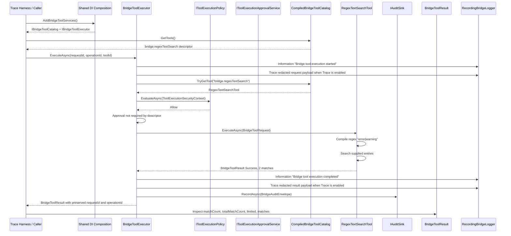

# Bridge Tool Execution Trace Workflow

> **Note (2026-07-19):** The methodology in this document is still valid for future sprint validation. Any dated log/diagram artifacts it references predate the early-design reset (see `SolutionFolder/docs/current-bridge-capabilities.md`) and are historical evidence only — do not treat them as current validation.


Use this workflow to repeat the observed bridge tool execution validation, capture durable artifacts, and compare the resulting sequence against the current shared tool code.

## Purpose

Provide a repeatable AI-friendly and developer-friendly process for:

- invoking a compiled bridge tool through `IBridgeToolExecutor`
- proving catalog discovery through `CompiledBridgeToolCatalog` and the default compiled discovery adapter
- proving bridge tool manifest metadata derived from descriptors
- proving read-only catalog inventory metadata without executing tools
- proving the minimal policy/capability/approval/secret-reference/redaction/audit seams around execution
- collecting correlated execution-boundary logs
- preserving request and operation correlation IDs
- generating a Mermaid sequence diagram from observed behavior
- producing durable artifacts future sessions can use for triage before expanding into plugin loading or search ranking

## Scope

This workflow documents the shared compiled bridge tool path only.
The catalog may now be fed by discovery providers, but this baseline keeps MEF directory discovery disabled and validates the default compiled tool path.
Tool manifests are lightweight metadata derived from `BridgeToolDescriptor`; this workflow does not introduce persistent manifests, package publishing, remote tools, signed plugin metadata, OAuth/RBAC/user identity, or a MEF redesign.

It does not validate:

- MEF directory discovery
- directory-loaded plugins as a production plugin model
- BM25 trace artifact generation; BM25 remains a compiled in-memory bridge tool covered by unit tests
- MCP stdio transport
- named-pipe transport
- presenter, proposal, or Visual Studio service behavior

## Observed Baseline Run

This workflow was validated with a temporary console harness that used the production shared DI/tool services:

- run name: `tool-regex-search-trace-20260509`
- branch: `main`
- commit: `85401fd`
- catalog: `CompiledBridgeToolCatalog`
- executor: `BridgeToolExecutor`
- policy: `AllowToolExecutionPolicy`
- approval service: `AllowToolExecutionApprovalService`, not invoked for descriptors with `ApprovalRequirement=NotRequired`
- redactor: `BridgeSecurityRedactor`
- audit sink: `NoOpAuditSink`
- tool: `bridge.regexTextSearch`
- request id: `tool-trace-20260509-req-001`
- operation id: `tool-regex-search-20260509-op-001`
- pattern: `error|warning`
- case sensitive: `false`
- max results: `10`
- observed result: success, 2 returned matches, 2 total matches

Reference artifacts:

- sequence diagram: [`SolutionFolder/docs/diagrams/tool-regex-search-trace-20260509.mmd`](diagrams/tool-regex-search-trace-20260509.mmd)
- observed log transcript: [`SolutionFolder/artifacts/logs/tool-regex-search-trace-20260509.log`](../artifacts/logs/tool-regex-search-trace-20260509.log)
- run metadata: [`SolutionFolder/artifacts/logs/tool-regex-search-trace-20260509.metadata.json`](../artifacts/logs/tool-regex-search-trace-20260509.metadata.json)
- session handoff: [`SolutionFolder/docs/session-handoffs/2026-05-09-tool-execution-validation.md`](session-handoffs/2026-05-09-tool-execution-validation.md)

## Observed Security-Aware Run

After the foundational security seams were added, the compiled regex text-search path was revalidated with secret-like inputs and an in-memory audit sink:

- run name: `tool-security-trace-20260509`
- branch: `main`
- commit: `aa9a849`
- catalog: `CompiledBridgeToolCatalog`
- executor: `BridgeToolExecutor`
- policy: trace-only `RecordingAllowPolicy`
- approval service: default approval service; `RegexTextSearchTool` does not require approval
- redactor: `BridgeSecurityRedactor`
- audit sink: `InMemoryAuditSink`
- tool: `bridge.regexTextSearch`
- request id: `tool-security-trace-20260509-req-001`
- operation id: `tool-security-trace-20260509-op-001`
- pattern: `warning|error|authorization|password|token|apiKey`
- observed result: success, 10 returned matches, 10 total matches

Security-aware reference artifacts:

- sequence diagram: [`SolutionFolder/docs/diagrams/tool-security-trace-20260509.mmd`](diagrams/tool-security-trace-20260509.mmd)
- observed log transcript: [`SolutionFolder/artifacts/logs/tool-security-trace-20260509.log`](../artifacts/logs/tool-security-trace-20260509.log)
- run metadata: [`SolutionFolder/artifacts/logs/tool-security-trace-20260509.metadata.json`](../artifacts/logs/tool-security-trace-20260509.metadata.json)
- session handoff: [`SolutionFolder/docs/session-handoffs/2026-05-09-tool-security-validation.md`](session-handoffs/2026-05-09-tool-security-validation.md)

This run intentionally used secret-like `apiKey`, `token`, `password`, and bearer authorization inputs. Durable artifacts store only redacted payload evidence and must not contain raw secret values.

## Observed MEF Discovery Boundary Run

After the minimal MEF discovery seam was added, the discovery boundary was validated separately from the compiled execution baseline:

- run name: `mef-discovery-trace-20260516`
- branch: `main`
- commit: `8777929`
- catalog: `CompiledBridgeToolCatalog`
- discovery providers: `CompiledBridgeToolDiscovery`, `MefBridgeToolDiscovery`
- executor: `BridgeToolExecutor`
- audit sink: `InMemoryAuditSink`
- MEF test tool id: `fake.mef`
- request id: `mef-discovery-trace-20260516-req-001`
- operation id: `mef-discovery-trace-20260516-op-001`

MEF discovery reference artifacts:

- sequence diagram: [`SolutionFolder/docs/diagrams/mef-discovery-trace-20260516.mmd`](diagrams/mef-discovery-trace-20260516.mmd)
- observed log transcript: [`SolutionFolder/artifacts/logs/mef-discovery-trace-20260516.log`](../artifacts/logs/mef-discovery-trace-20260516.log)
- run metadata: [`SolutionFolder/artifacts/logs/mef-discovery-trace-20260516.metadata.json`](../artifacts/logs/mef-discovery-trace-20260516.metadata.json)
- session handoff: [`SolutionFolder/docs/session-handoffs/2026-05-16-mef-discovery-trace-validation.md`](session-handoffs/2026-05-16-mef-discovery-trace-validation.md)

This trace covers MEF discovery start, configured directories, missing-directory behavior, invalid assembly load behavior, discovery completion, catalog composition, and the preserved executor boundary. It deliberately uses the existing shared-test `MefFakeBridgeTool` export and does not add a production tool.

## Observed Approval-Aware Boundary Run

After approval-aware execution was added to `BridgeToolExecutor`, the approval boundary was documented with the existing shared-test fake approval-required tool path:

- run name: `tool-approval-trace-20260516`
- branch: `main`
- commit: `1d2cfc7`
- catalog: `CompiledBridgeToolCatalog`
- executor: `BridgeToolExecutor`
- policy: `AllowToolExecutionPolicy`
- approval service: shared-test `RecordingToolExecutionApprovalService`
- redactor: `BridgeSecurityRedactor`
- audit sink: `InMemoryAuditSink`
- test tool id: `fake.approvalRequired`
- approved request id: `tool-approval-trace-20260516-allow-req-001`
- denied request id: `tool-approval-trace-20260516-deny-req-001`

Approval-aware reference artifacts:

- sequence diagram: [`SolutionFolder/docs/diagrams/tool-approval-trace-20260516.mmd`](diagrams/tool-approval-trace-20260516.mmd)
- observed log transcript: [`SolutionFolder/artifacts/logs/tool-approval-trace-20260516.log`](../artifacts/logs/tool-approval-trace-20260516.log)
- run metadata: [`SolutionFolder/artifacts/logs/tool-approval-trace-20260516.metadata.json`](../artifacts/logs/tool-approval-trace-20260516.metadata.json)
- session handoff: [`SolutionFolder/docs/session-handoffs/2026-05-16-tool-approval-validation.md`](session-handoffs/2026-05-16-tool-approval-validation.md)

This trace covers approved and denied approval decisions without adding a runtime user-facing tool, UI approval prompt, proposal approval redesign, or MCP transport change.
It proves approval decisions are visible through executor logs, structured results, audit metadata, redaction, and request/operation correlation.

## Observed Manifest Metadata Run

After the lightweight manifest model was added to `BridgeToolDescriptor`, manifest metadata flow was validated with the compiled regex text-search path plus a harness-only approval-required probe:

- run name: `tool-manifest-trace-20260516`
- branch: `main`
- commit: `5e9b71f`
- capture date: `2026-05-20`
- catalog: `CompiledBridgeToolCatalog`
- executor: `BridgeToolExecutor`
- policy: trace-only `RecordingPolicy`
- approval service: default approval service for `RegexTextSearchTool`; harness-only `RecordingApprovalService` for approval-context observation
- redactor: `BridgeSecurityRedactor`
- audit sink: `InMemoryAuditSink`
- compiled tool id: `bridge.regexTextSearch`
- request id: `tool-manifest-trace-20260516-req-001`
- operation id: `tool-manifest-trace-20260516-op-001`
- observed result: success, 2 returned matches, 2 total matches

Manifest metadata reference artifacts:

- sequence diagram: [`SolutionFolder/docs/diagrams/tool-manifest-trace-20260516.mmd`](diagrams/tool-manifest-trace-20260516.mmd)
- observed log transcript: [`SolutionFolder/artifacts/logs/tool-manifest-trace-20260516.log`](../artifacts/logs/tool-manifest-trace-20260516.log)
- run metadata: [`SolutionFolder/artifacts/logs/tool-manifest-trace-20260516.metadata.json`](../artifacts/logs/tool-manifest-trace-20260516.metadata.json)
- session handoff: [`SolutionFolder/docs/session-handoffs/2026-05-16-tool-manifest-validation.md`](session-handoffs/2026-05-16-tool-manifest-validation.md)

This trace proves descriptor-derived manifest metadata is visible through catalog descriptors, `ToolExecutionSecurityContext`, trace logging, and audit metadata.
It also uses a temporary harness-only approval-required tool to observe `ToolExecutionApprovalContext.Manifest` without adding a production tool or changing runtime behavior.
The MEF path is documented from existing shared-test evidence for `MefFakeBridgeTool`; this trace does not change MEF behavior.

## Observed Inventory Snapshot Run

After the read-only catalog inventory seam was added, inventory behavior was validated with compiled tools and an explicitly enabled MEF test-export path:

- run name: `tool-inventory-trace-20260516`
- branch: `main`
- commit: `9708609`
- capture date: `2026-05-20`
- inventory service: `IBridgeToolInventoryService`
- catalog: `CompiledBridgeToolCatalog`
- compiled discovery: `CompiledBridgeToolDiscovery`
- MEF discovery: `MefBridgeToolDiscovery` scanning the existing shared-test assembly
- compiled snapshot order: `bridge.bm25TextSearch`, `bridge.regexTextSearch`
- MEF-enabled snapshot order: `bridge.bm25TextSearch`, `bridge.regexTextSearch`, `fake.mef`
- observed result: deterministic read-only snapshots with no tool execution

Inventory reference artifacts:

- sequence diagram: [`SolutionFolder/docs/diagrams/tool-inventory-trace-20260516.mmd`](diagrams/tool-inventory-trace-20260516.mmd)
- observed log transcript: [`SolutionFolder/artifacts/logs/tool-inventory-trace-20260516.log`](../artifacts/logs/tool-inventory-trace-20260516.log)
- run metadata: [`SolutionFolder/artifacts/logs/tool-inventory-trace-20260516.metadata.json`](../artifacts/logs/tool-inventory-trace-20260516.metadata.json)
- session handoff: [`SolutionFolder/docs/session-handoffs/2026-05-16-tool-inventory-validation.md`](session-handoffs/2026-05-16-tool-inventory-validation.md)

This trace proves inventory snapshots read descriptor-derived manifest metadata from the catalog and sort by tool id.
At the time of that trace, inventory was not exposed over MCP; the later MCP diagnostic below adds read-only transport visibility without changing bridge tool execution behavior.

## Observed MCP Inventory Diagnostic Run

The bridge tool catalog inventory is now visible through MCP as the diagnostic tool `bridge_get_tool_inventory`:

- run name: `mcp-tool-inventory-trace-20260516`
- branch: `main`
- baseline commit: `644b17e`
- capture date: `2026-05-20`
- MCP tool: `bridge_get_tool_inventory`
- inventory service: `IBridgeToolInventoryService`
- compiled snapshot order: `bridge.bm25TextSearch`, `bridge.regexTextSearch`
- observed result: metadata-only deterministic inventory returned through MCP without tool execution

MCP inventory diagnostic artifacts:

- sequence diagram: [`SolutionFolder/docs/diagrams/mcp-tool-inventory-trace-20260516.mmd`](diagrams/mcp-tool-inventory-trace-20260516.mmd)
- observed log transcript: [`SolutionFolder/artifacts/logs/mcp-tool-inventory-trace-20260516.log`](../artifacts/logs/mcp-tool-inventory-trace-20260516.log)
- session handoff: [`SolutionFolder/docs/session-handoffs/2026-05-16-mcp-tool-inventory-validation.md`](session-handoffs/2026-05-16-mcp-tool-inventory-validation.md)

This diagnostic calls only `IBridgeToolInventoryService.GetSnapshot()`.
It does not invoke `BridgeToolExecutor`, `IToolExecutionPolicy`, `IToolExecutionApprovalService`, `IAuditSink`, `IPipeClient`, `IChatEngine`, or bridge tool `ExecuteAsync`.
It logs request id, elapsed time, and tool count without logging raw payloads or secrets.

## Live MCP Inventory Validation Run

The MCP inventory diagnostic was validated through direct MCP stdio after it was added:

- run name: `mcp-tool-inventory-live-validation-20260516`
- branch: `main`
- baseline commit: `633db89`
- capture date: `2026-05-20`
- validation mode: direct MCP stdio helper using `ModelContextProtocol.Client`
- server info: `VsMcpBridge.McpServer 1.0.0.0`
- `tools/list` count: `17`
- MCP tool: `bridge_get_tool_inventory`
- response request id: `286de633c1754c8fb844c283be487d06`
- response tool count: `2`
- response order: `bridge.bm25TextSearch`, `bridge.regexTextSearch`

Live MCP validation artifacts:

- sequence diagram: [`SolutionFolder/docs/diagrams/mcp-tool-inventory-live-validation-20260516.mmd`](diagrams/mcp-tool-inventory-live-validation-20260516.mmd)
- observed log transcript: [`SolutionFolder/artifacts/logs/mcp-tool-inventory-live-validation-20260516.log`](../artifacts/logs/mcp-tool-inventory-live-validation-20260516.log)
- run metadata: [`SolutionFolder/artifacts/logs/mcp-tool-inventory-live-validation-20260516.metadata.json`](../artifacts/logs/mcp-tool-inventory-live-validation-20260516.metadata.json)
- session handoff: [`SolutionFolder/docs/session-handoffs/2026-05-16-mcp-tool-inventory-live-validation.md`](session-handoffs/2026-05-16-mcp-tool-inventory-live-validation.md)

The server log for the live run contains the diagnostic start/completion markers with the same request id and `ToolCount=2`.
No Visual Studio/Copilot validation was required for this slice because the diagnostic is MCP-only and does not depend on VSIX activation or named-pipe state.

## Live MCP Regex Search Validation Run

The compiled regex search tool is now callable through MCP as `bridge_regex_text_search`:

- run name: `mcp-regex-search-trace-20260516`
- branch: `main`
- baseline commit: `260a457`
- capture date: `2026-05-22`
- validation mode: direct MCP stdio helper using `ModelContextProtocol.Client`
- server info: `VsMcpBridge.McpServer 1.0.0.0`
- `tools/list` count: `18`
- MCP tool: `bridge_regex_text_search`
- bridge tool id: `bridge.regexTextSearch`
- successful response request id: `1aaa4f65369b494eb4e77bd7a3970029`
- successful response operation id: `c802106d919f4f95a09cf2578d8cb773`
- successful response counts: `matchCount=1`, `totalMatchCount=2`, `limited=true`
- invalid regex response: `success=false`, `errorCode=InvalidRegex`

Live MCP regex search artifacts:

- sequence diagram: [`SolutionFolder/docs/diagrams/mcp-regex-search-trace-20260516.mmd`](diagrams/mcp-regex-search-trace-20260516.mmd)
- observed log transcript: [`SolutionFolder/artifacts/logs/mcp-regex-search-trace-20260516.log`](../artifacts/logs/mcp-regex-search-trace-20260516.log)
- run metadata: [`SolutionFolder/artifacts/logs/mcp-regex-search-trace-20260516.metadata.json`](../artifacts/logs/mcp-regex-search-trace-20260516.metadata.json)
- session handoff: [`SolutionFolder/docs/session-handoffs/2026-05-16-mcp-regex-search-validation.md`](session-handoffs/2026-05-16-mcp-regex-search-validation.md)

This wrapper accepts only explicit `inputText` or `entries` supplied in the MCP request.
It does not read filesystem paths, crawl repositories, mutate state, call ChatEngine, or call the VSIX named pipe.
The wrapper builds a `BridgeToolRequest` and calls `IBridgeToolExecutor.ExecuteAsync`, so executable bridge tool policy, approval, redaction, audit, manifest, and correlation behavior remains owned by `BridgeToolExecutor`.

## Live MCP BM25 Search Validation Run

The compiled BM25 search tool is now callable through MCP as `bridge_bm25_text_search`:

- run name: `mcp-bm25-search-trace-20260516`
- branch: `main`
- baseline commit: `29c713f`
- capture date: `2026-05-22`
- validation mode: direct MCP stdio helper using explicit in-memory documents
- server info: `VsMcpBridge.McpServer 1.0.0.0`
- `tools/list` count: `19`
- MCP tool: `bridge_bm25_text_search`
- bridge tool id: `bridge.bm25TextSearch`
- successful response request id: `b2f5a3c9174548f8bd692f8c9411f172`
- successful response operation id: `1c7b57acc47f4efd976617fce3b39a11`
- successful response counts: `resultCount=2`, `totalResultCount=3`, `limited=true`
- empty query response: `success=false`, `errorCode=InvalidRequest`
- empty documents response: `success=false`, `errorCode=InvalidRequest`

Live MCP BM25 search artifacts:

- sequence diagram: [`SolutionFolder/docs/diagrams/mcp-bm25-search-trace-20260516.mmd`](diagrams/mcp-bm25-search-trace-20260516.mmd)
- observed log transcript: [`SolutionFolder/artifacts/logs/mcp-bm25-search-trace-20260516.log`](../artifacts/logs/mcp-bm25-search-trace-20260516.log)
- run metadata: [`SolutionFolder/artifacts/logs/mcp-bm25-search-trace-20260516.metadata.json`](../artifacts/logs/mcp-bm25-search-trace-20260516.metadata.json)
- session handoff: [`SolutionFolder/docs/session-handoffs/2026-05-16-mcp-bm25-search-validation.md`](session-handoffs/2026-05-16-mcp-bm25-search-validation.md)

This wrapper accepts only explicit `documents` or `entries` supplied in the MCP request.
It does not read filesystem paths, crawl repositories, mutate state, call ChatEngine, or call the VSIX named pipe.
The wrapper builds a `BridgeToolRequest` and calls `IBridgeToolExecutor.ExecuteAsync`, so executable bridge tool policy, approval, redaction, audit, manifest, and correlation behavior remains owned by `BridgeToolExecutor`.

## Live MCP Document Selection Validation Run

The explicit repo document selection helper is now callable through MCP as `bridge_select_repo_documents`:

- run name: `mcp-document-selection-trace-20260516`
- branch: `main`
- baseline commit: `207e584`
- capture date: `2026-05-22`
- validation mode: direct MCP stdio helper using caller-supplied root-relative include/exclude patterns
- server info: `VsMcpBridge.McpServer 1.0.0.0`
- `tools/list` count: `20`
- MCP tool: `bridge_select_repo_documents`
- selection response request id: `840ad550e4c1471caca63d5450854f92`
- selected candidate count: `10`
- returned document count: `8`
- limited: `true`
- broad root wildcard response: `success=false`, `errorCode=InvalidRequest`

Live MCP document selection artifacts:

- sequence diagram: [`SolutionFolder/docs/diagrams/mcp-document-selection-trace-20260516.mmd`](diagrams/mcp-document-selection-trace-20260516.mmd)
- observed log transcript: [`SolutionFolder/artifacts/logs/mcp-document-selection-trace-20260516.log`](../artifacts/logs/mcp-document-selection-trace-20260516.log)
- session handoff: [`SolutionFolder/docs/session-handoffs/2026-05-16-document-selection-validation.md`](session-handoffs/2026-05-16-document-selection-validation.md)

This helper accepts only explicit repo-root-relative include/exclude patterns and returns deterministic metadata for selected files.
It does not search content, rank relevance, execute bridge tools, mutate state, call ChatEngine, call the VSIX named pipe, build a hidden cache, or create an index.
The caller remains responsible for reading selected files and passing explicit `entries` or `documents` into `bridge_regex_text_search` or `bridge_bm25_text_search`.

## MCP Preview Document Update Validation Run

The preview-only document update tool is callable through MCP as `bridge_preview_document_update`:

- run name: `mcp-preview-document-update-trace-20260517`
- branch: `main`
- baseline commit: `2ff8d9e`
- capture date: `2026-05-23`
- validation mode: shared tests plus MCP wrapper unit coverage
- MCP tool: `bridge_preview_document_update`
- bridge tool id: `bridge.previewDocumentUpdate`
- deterministic test request id: `request-123`
- deterministic test operation id: `operation-456`
- observed statuses: `PreviewGenerated`, `NoOp`, `DriftDetected`, `InvalidRequest`
- observed safety result: no target file mutation on success, no-op, drift, or invalid-path failures

Preview document update artifacts:

- sequence diagram: [`SolutionFolder/docs/diagrams/mcp-preview-document-update-trace-20260517.mmd`](diagrams/mcp-preview-document-update-trace-20260517.mmd)
- observed log transcript: [`SolutionFolder/artifacts/logs/mcp-preview-document-update-trace-20260517.log`](../artifacts/logs/mcp-preview-document-update-trace-20260517.log)
- run metadata: [`SolutionFolder/artifacts/logs/mcp-preview-document-update-trace-20260517.metadata.json`](../artifacts/logs/mcp-preview-document-update-trace-20260517.metadata.json)
- session handoff: [`SolutionFolder/docs/session-handoffs/2026-05-17-preview-document-update-validation.md`](session-handoffs/2026-05-17-preview-document-update-validation.md)

This wrapper accepts only one explicit repo-root-relative target path and caller-supplied expected content or expected SHA-256 content hash plus full replacement content.
It rejects absolute paths, parent traversal, and wildcards; it does not crawl directories, execute patches, write files, call ChatEngine, call the VSIX named pipe, or create an approval/apply path.
The wrapper builds a `BridgeToolRequest` and calls `IBridgeToolExecutor.ExecuteAsync`, so policy, approval metadata, redaction, audit classification, manifest metadata, and request/operation correlation remain owned by `BridgeToolExecutor`.

## MCP Search Diagnostic Selection

Use `.agents/skills/mcp-search-diagnostics/SKILL.md` for concise agent guidance before running MCP search diagnostics.
Use `SolutionFolder/docs/evidence-classification-guidance.md` when search results need to distinguish canonical/current source from historical, rendered-failure, handoff, or diagnostic trace evidence.

- Start MCP/tooling triage with `bridge_get_tool_inventory`.
- Use `bridge_select_repo_documents` when a workflow needs deterministic repo-root-relative file metadata before building explicit search inputs.
- Use `bridge_regex_text_search` for exact markers, regex patterns, structural text checks, and deterministic evidence searches.
- Use `bridge_bm25_text_search` for ranked relevance over a bounded explicit document set.
- Use `bridge_preview_document_update` only for deterministic preview-only full-document update diffs against one explicit target path.
- Build the document/text set in the caller and pass only explicit `inputText`, `entries`, or `documents` to MCP.
- Record evidence category with selected files when category affects whether a finding is actionable.
- Do not pass paths expecting the MCP tools to read files; they do not crawl files or mutate state.
- If MCP is unavailable, use deterministic repo search such as `rg` and preserve that fallback path in the resulting handoff or notes.

## Explicit-Input MCP Regex Search Workload

The BlogAI stale shared chrome/cache workload was rerun with `bridge_regex_text_search` after the MCP wrapper was added.

- run name: `blogai-stale-chrome-mcp-regex-search-20260516`
- baseline commit: `da5a9d1`
- capture date: `2026-05-22`
- validation mode: direct MCP stdio helper with caller-selected explicit text entries
- marker: `feature/approval-apply-ui-slice`
- entries supplied to MCP: `8`
- files represented by caller-selected entries: `47`
- successful response request id: `85439ee022a74a1a98f9ac16a0d423e1`
- successful response operation id: `deadbde2478547d3889330b1c24da8eb`
- successful response counts: `matchCount=61`, `totalMatchCount=61`, `limited=false`

Observed zero-match entries:

- canonical `SolutionFolder/docs/blogs/posts` aggregate
- selected local BlogAI source files
- current after-update widget row `26512` settings

Observed matching entries:

- stale shared chrome inspection report
- final rendered route failure after cache clear report
- preserved before-update widget row `26512` evidence
- historical DB export sample rows
- prior stale chrome search handoff

This established the reusable MCP regex pattern for future AI pressure-test workloads:

1. choose a bounded set of source/evidence files in the caller
2. read those files outside the MCP tool
3. pass only explicit `inputText` or `entries` to `bridge_regex_text_search`
4. preserve request id, operation id, inputs, matched entries, and safety notes in durable artifacts

Artifacts:

- sequence diagram: [`SolutionFolder/docs/diagrams/blogai-stale-chrome-mcp-regex-search-20260516.mmd`](diagrams/blogai-stale-chrome-mcp-regex-search-20260516.mmd)
- observed log transcript: [`SolutionFolder/artifacts/logs/blogai-stale-chrome-mcp-regex-search-20260516.log`](../artifacts/logs/blogai-stale-chrome-mcp-regex-search-20260516.log)
- run metadata: [`SolutionFolder/artifacts/logs/blogai-stale-chrome-mcp-regex-search-20260516.metadata.json`](../artifacts/logs/blogai-stale-chrome-mcp-regex-search-20260516.metadata.json)
- session handoff: [`SolutionFolder/docs/session-handoffs/2026-05-16-blogai-stale-chrome-mcp-regex-search.md`](session-handoffs/2026-05-16-blogai-stale-chrome-mcp-regex-search.md)

## Explicit Document Selection Plus MCP Search Workload

The BlogAI stale shared chrome/cache workload was repeated with the full selector + search chain:

1. `bridge_select_repo_documents`
2. caller file reads for the selected paths
3. `bridge_regex_text_search`
4. `bridge_bm25_text_search`

- run name: `blogai-doc-selection-search-workflow-20260516`
- baseline commit: `83a79ab`
- capture date: `2026-05-22`
- validation mode: direct MCP stdio helper with explicit include/exclude patterns
- selected documents: `90`
- selection request id: `a967bf52775344298cd42dd57c33c53f`
- regex exact marker request id: `18fea4c5bf234c7d885ff2d19e0659f9`
- regex exact marker operation id: `29fcdfc81f5a4248a368fedbdf452482`
- BM25 request id: `8e9d6930bc534c249b14c73d81546a9f`
- BM25 operation id: `f430b1b6ce66493e9e5f9d63dde630c8`
- fallback `rg`: no

Observed outcome:

- the stale marker matched durable reports, prepublish evidence, and handoffs
- the stale marker did not match selected canonical post content or metadata
- BM25 ranked stale chrome/cache handoffs and cache-clear reports highest

Artifacts:

- observed log transcript: [`SolutionFolder/artifacts/logs/blogai-doc-selection-search-workflow-20260516.log`](../artifacts/logs/blogai-doc-selection-search-workflow-20260516.log)
- run metadata: [`SolutionFolder/artifacts/logs/blogai-doc-selection-search-workflow-20260516.metadata.json`](../artifacts/logs/blogai-doc-selection-search-workflow-20260516.metadata.json)
- sequence diagram: [`SolutionFolder/docs/diagrams/blogai-doc-selection-search-workflow-20260516.mmd`](diagrams/blogai-doc-selection-search-workflow-20260516.mmd)
- session handoff: [`SolutionFolder/docs/session-handoffs/2026-05-16-blogai-doc-selection-search-workflow.md`](session-handoffs/2026-05-16-blogai-doc-selection-search-workflow.md)

## Preconditions

- repository root: `Y:s-mcp-bridge`
- branch and commit should be recorded before the run
- current shared tests should pass:

```powershell
dotnet test .\VsMcpBridge.Shared.Tests\VsMcpBridge.Shared.Tests.csproj
```

- tool execution should use `AddBridgeToolServices()` so the catalog/executor path matches shared composition
- leave `BridgeToolDiscoveryOptions.EnableMefDirectoryDiscovery` disabled for this compiled-tool baseline unless creating a separate MEF discovery trace
- the harness may override `IAuditSink` with `InMemoryAuditSink` when audit envelope assertions are part of the run
- use a deterministic request id and operation id in the trace harness

## Run Procedure

### 1. Create a small trace harness

Use a temporary console app outside the repository, or an equivalent test harness, that references:

- `VsMcpBridge.Shared`
- `Microsoft.Extensions.DependencyInjection`
- `Microsoft.Extensions.Logging`
- `VsMcpBridge.Shared.Composition`
- `VsMcpBridge.Shared.Loggers`
- `VsMcpBridge.Shared.Tools`

The harness should:

1. create a `RecordingBridgeLogger`
2. register it as `ILogger`
3. call `services.AddBridgeToolServices()` without enabling MEF directory discovery
4. resolve `IBridgeToolCatalog`
5. resolve `IBridgeToolExecutor`
6. optionally resolve `ISecurityRedactor`, `IAuditSink`, `IToolExecutionPolicy`, and `IToolExecutionApprovalService` to confirm the security seams are present
7. create a `BridgeToolRequest` for `RegexTextSearchTool.ToolId`
8. execute through `IBridgeToolExecutor.ExecuteAsync`
9. print catalog descriptors, derived manifest metadata, logger entries, audit envelope data when captured, result metadata, and returned matches

For security-aware runs, override the default `NoOpAuditSink` with `InMemoryAuditSink` before calling `AddBridgeToolServices()`, and use trace-only policy or approval wrappers when you need to print observed decisions without changing production defaults.
Capability-aware traces should use a fake or test tool descriptor with `RequiredCapabilities` populated; existing compiled tools declare no required capabilities by default.
Capability metadata is policy input only in the current bridge. `CapabilityToolExecutionPolicy` can be used explicitly in tests or harnesses to evaluate static allowed, denied, and unknown required capabilities.
It is not authentication, OAuth scope enforcement, role/user identity, UI permission prompting, persistent policy storage, remote authorization, sandboxing, or production authorization.
Secret-reference traces should use synthetic `SecretReference` values and a fake broker. The default `NoOpSecretBroker` returns unresolved, and unresolved references must produce a structured `SecretReferenceUnresolved` result before tool execution.
Secret references are future-proof indirection metadata only; they are not real secret storage, encryption, Azure Key Vault integration, external provider integration, authentication, persistence, or raw secret injection.
Approval-aware traces should use a fake or test tool descriptor with `ApprovalRequirement=Required`; existing compiled tools remain approval-not-required by default.
The current durable approval trace uses the shared-test `ApprovalRequiredBridgeTool` fixture and `RecordingToolExecutionApprovalService`.

### 2. Use deterministic request input

Baseline input:

```text
ToolId: bridge.regexTextSearch
RequestId: tool-trace-20260509-req-001
OperationId: tool-regex-search-20260509-op-001
pattern: error|warning
caseSensitive: false
maxResults: 10
entries:
- Info: startup complete
- Warning: configuration fallback used
- Error: sample failure marker
- Trace: execution complete
```

Expected result:

- `Success=True`
- `matchCount=2`
- `totalMatchCount=2`
- `limited=False`
- returned values include `Warning` and `Error`

### 3. Capture correlated logs

The executor boundary must produce at least:

```text
Bridge tool execution started [ToolId=bridge.regexTextSearch] [RequestId=tool-trace-20260509-req-001] [OperationId=tool-regex-search-20260509-op-001].
Bridge tool execution completed [ToolId=bridge.regexTextSearch] [RequestId=tool-trace-20260509-req-001] [OperationId=tool-regex-search-20260509-op-001] [Success=True] [ElapsedMs=<n>].
```

Every line in the observed execution boundary should preserve the same request id and operation id.
Trace-level request/result payload logs, when captured, must be redacted before being stored as durable artifacts.

For failure-path traces, capture:

- `ErrorCode`
- failure message
- exception type if one was logged
- manifest identity, version, category, source/discovery kind, and host affinity
- whether the failure was structured by the tool or caught by `BridgeToolExecutor`
- which required capabilities were declared by the descriptor
- which secret references were declared in the request arguments
- whether secret references resolved or failed structurally
- whether policy allowed or denied execution
- whether tool approval was not required, approved, or denied
- whether an audit envelope was emitted with request id and operation id

### 4. Preserve durable artifacts

For each new run, create dated files instead of overwriting existing artifacts:

- `SolutionFolder/artifacts/logs/<run-name>.log`
- `SolutionFolder/artifacts/logs/<run-name>.metadata.json`
- `SolutionFolder/docs/diagrams/<run-name>.mmd`
- optionally `SolutionFolder/docs/session-handoffs/<date>-<topic>.md` when the run changes the resume point

Metadata should include:

- branch
- commit
- tool id
- request id
- operation id
- input summary
- observed result summary
- capture method
- explicit scope exclusions

If `.gitignore` blocks the files, whitelist the exact durable artifact paths.

## Mermaid Generation Pattern

Build the Mermaid sequence from observed logs and result output, not from the intended design alone.

Use this baseline shape for the compiled regex text-search path:



## Code Comparison Checklist

After generating the sequence, compare it to current code.

Confirm:

- `AddBridgeToolServices` registers `RegexTextSearchTool` as compiled `IBridgeTool`
- `AddBridgeToolServices` registers `Bm25TextSearchTool` as a compiled in-memory `IBridgeTool`
- `AddBridgeToolServices` registers `CompiledBridgeToolDiscovery` and optional `MefBridgeToolDiscovery`
- `AddBridgeToolServices` registers default security seams through `AddBridgeSecurityServices`
- `AddBridgeSecurityServices` registers `IToolExecutionApprovalService`
- `CompiledBridgeToolCatalog.GetTools()` exposes the descriptor
- each descriptor derives a `BridgeToolManifest` with stable id, name, version, description, category, source/discovery kind, required capabilities, approval requirement, risk hint, and optional host affinity
- `IBridgeToolInventoryService.GetSnapshot()` exposes deterministic descriptor-derived manifest inventory metadata ordered by tool id without invoking tools
- `BridgeToolExecutor.ExecuteAsync` logs start before catalog lookup
- `BridgeToolExecutor.ExecuteAsync` logs redacted manifest metadata after catalog lookup
- `BridgeToolExecutor.ExecuteAsync` logs redacted required-capability metadata after catalog lookup
- `ToolExecutionSecurityContext` and `ToolExecutionApprovalContext` expose derived manifest metadata without changing policy or approval defaults
- `BridgeToolExecutor.ExecuteAsync` evaluates `IToolExecutionPolicy` before invoking the tool
- `ToolExecutionSecurityContext.RequiredCapabilities` exposes descriptor-declared capabilities to policy
- `ToolExecutionSecurityContext.SecretReferences` exposes structured request secret references to policy
- `CapabilityToolExecutionPolicy` is optional and is not the default DI policy
- when `CapabilityToolExecutionPolicy` denies, `BridgeToolExecutor` returns a structured `PolicyDenied` result before approval or tool execution
- `BridgeToolExecutor.ExecuteAsync` evaluates approval only when the descriptor requires it
- approval-denied executions return structured `ApprovalDenied` failures and do not invoke the tool
- unresolved secret references return structured `SecretReferenceUnresolved` failures and do not invoke the tool
- `BridgeToolExecutor.ExecuteAsync` emits a `BridgeAuditEnvelope` after terminal outcomes
- audit metadata includes manifest identity/version/category/source/discovery/host metadata, redacted required capabilities, secret references, secret resolution status, approval requirement, approval decision, and redacted approval reason
- audit classification metadata includes category, severity, risk level, and outcome for success, policy denial, approval denial, unresolved secret references, cancellation, and execution failure
- payload-oriented executor logs pass through `ISecurityRedactor`
- `BridgeToolExecutor.ExecuteAsync` preserves request id and operation id in all returned results
- `RegexTextSearchTool.ExecuteAsync` returns structured failure for invalid regex
- `Bm25TextSearchTool.ExecuteAsync` remains request-scoped and in-memory with no persistent index or crawler
- MEF directory discovery is not enabled, and no plugin directory, MCP transport, presenter, or proposal code is involved in this workflow

## MEF Discovery Boundary Note

MEF is discovery only. It may add exported `IBridgeTool` instances to the shared catalog when explicitly configured, but it does not execute tools during discovery and does not replace `BridgeToolExecutor`.
All discovered tools must still flow through executor policy evaluation, approval evaluation when required, redacted payload logging, terminal audit envelope emission, and request/operation correlation preservation.
Directory-loaded tools are not production sandboxing; plugin/tool authors do not own core audit, redaction, policy, approval, or correlation behavior.

When validating MEF discovery, keep the artifact separate from the compiled execution baseline and capture these boundaries:

- discovery start with `EnableMefDirectoryDiscovery`, directory count, and search pattern
- each configured directory outcome, including missing directories
- assembly-load warnings for invalid candidate DLLs
- discovery completion with assembly count and tool count
- composed catalog descriptors showing compiled and MEF sources
- proof that MEF-discovered tools remain unexecuted during discovery
- one executor call proving `BridgeToolExecutor` still owns policy, redaction, audit, and correlation

## Reuse Guidance For Future Sessions

When repeating this workflow:

1. use deterministic request and operation IDs
2. capture the catalog descriptor before execution
3. capture executor boundary logs, audit data when enabled, and final result data
4. confirm no raw secret-like values were written into logs, traces, prompts, exception dumps, or artifacts
5. include approval metadata when validating an approval-required test tool
6. generate the Mermaid diagram from observed output
7. compare the diagram against code before expanding the tool system
8. keep future MEF/plugin/BM25 traces separate from this compiled-tool baseline
