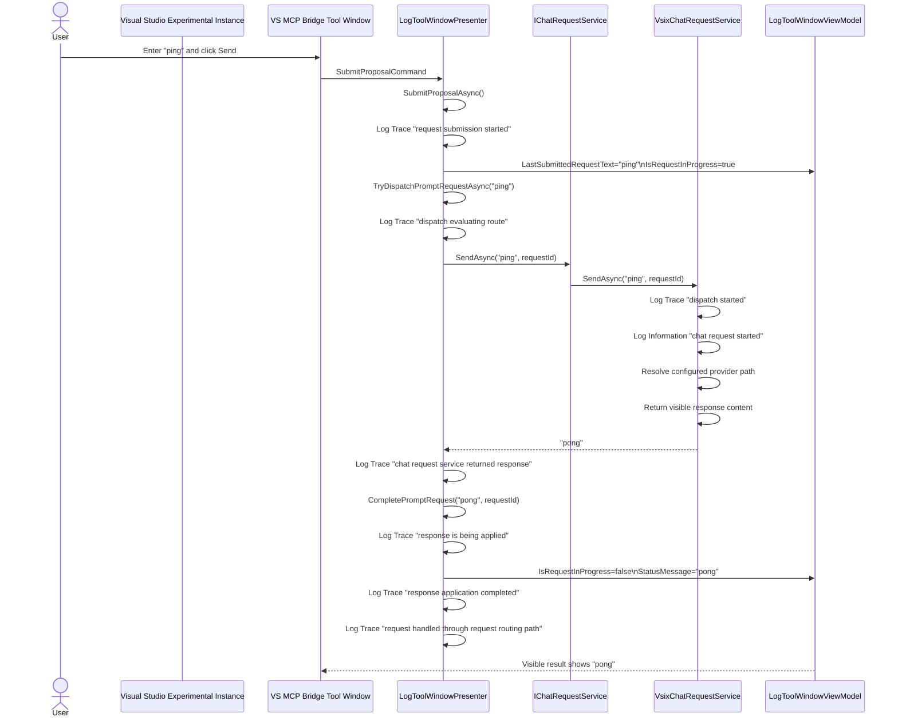

# VSIX Host Ping Trace Workflow

Use this workflow to repeat the observed end-to-end `ping` validation against the VSIX host running inside the Visual Studio Experimental Instance, capture durable artifacts, and compare the resulting sequence against the current code.

## Purpose

Provide a repeatable AI-friendly and developer-friendly process for:

- launching the Experimental Instance with VSIX Trace logging enabled
- exercising the live VS MCP Bridge tool window with `ping`
- collecting the visible result and correlated logs
- generating a Mermaid sequence diagram from observed behavior
- comparing the observed sequence to the current VSIX code path
- producing durable artifacts that can be reused in later sessions and future developer-facing explanations

## Scope

This workflow documents the observed VSIX-host path only.

It does not replace the App-host workflow. Keep App-host and VSIX-host observations separate because host configuration and runtime behavior can differ.

## Preconditions

- repository root: `Y:\vs-mcp-bridge`
- branch should be recorded before the run
- launch the Experimental Instance with:
  - `VSMCPBRIDGE_VsMcpBridge__Logging__Provider = StdErr`
  - `VSMCPBRIDGE_VsMcpBridge__Logging__MinimumLevel = Trace`
- record the effective chat provider mode observed inside the VSIX host before finalizing the artifact interpretation

## Observed Baseline Run

This workflow was validated on:

- date: `2026-05-08`
- branch: `feature/approval-apply-ui-slice`
- commit: `224b554`
- host: `VsMcpBridge.Vsix` in the Experimental Instance
- observed provider path: `OpenAI`
- prompt: `ping`
- visible result: `pong`
- observed correlation id: `cf7657ab510c489ba96e5b01ce03bfa7`
- interaction mode: UI automation against the live VS MCP Bridge tool window

Reference artifacts from this baseline run:

- sequence diagram: [`SolutionFolder/docs/diagrams/vsix-host-ping-trace-20260508.mmd`](diagrams/vsix-host-ping-trace-20260508.mmd)
- observed log transcript: [`SolutionFolder/artifacts/logs/vsix-host-ping-trace-20260508.log`](../artifacts/logs/vsix-host-ping-trace-20260508.log)
- run metadata: [`SolutionFolder/artifacts/logs/vsix-host-ping-trace-20260508.metadata.json`](../artifacts/logs/vsix-host-ping-trace-20260508.metadata.json)
- developer-facing summary: [`SolutionFolder/docs/blog-drafts/vsix-host-ping-trace-walkthrough-20260508.md`](blog-drafts/vsix-host-ping-trace-walkthrough-20260508.md)

## Run Procedure

### 1. Launch the Experimental Instance

From a PowerShell session rooted at the repository:

```powershell
Set-Location 'Y:\vs-mcp-bridge'
$env:VSMCPBRIDGE_VsMcpBridge__Logging__Provider = 'StdErr'
$env:VSMCPBRIDGE_VsMcpBridge__Logging__MinimumLevel = 'Trace'
Start-Process devenv.exe '/RootSuffix Exp Y:\vs-mcp-bridge\VsMcpBridge.slnx'
```

Expected startup evidence:

- the Experimental Instance opens on the solution
- the `VS MCP Bridge` tool window becomes visible or can be opened
- the tool window log surface contains initialization lines

### 2. Exercise the prompt surface

In the VS MCP Bridge tool window:

1. enter `ping` in the request input box
2. click `Send`
3. wait for the request to settle and the visible result surface to update

Expected visible results:

- the last submitted request shows `ping`
- the visible result surface shows a host-returned `pong`-style result
- the log panel shows correlated presenter and VSIX host-service entries with the same `RequestId`

### 3. Capture artifacts

Copy or save the following:

- UI log text from the tool window log surface
- visible request/result values
- effective runtime configuration snapshot for logging and chat provider settings
- branch and commit information

Suggested durable outputs:

- `SolutionFolder/artifacts/logs/<run-name>.log` for trimmed observed logs
- `SolutionFolder/artifacts/logs/<run-name>.metadata.json` for environment and config metadata
- `SolutionFolder/docs/diagrams/<run-name>.mmd` for the Mermaid sequence
- `SolutionFolder/docs/blog-drafts/<run-name>.md` for a short developer-facing explanation when the run establishes or updates durable understanding

## Expected Log Pattern

For the observed VSIX-host ping path, the baseline sequence was:

1. `Prompt-box request submission started`
2. `Prompt-box request dispatch evaluating route`
3. `Prompt-box request routed to chat request service`
4. `VSIX chat request dispatch started`
5. `VSIX chat request started`
6. `VSIX chat request dispatch completed with visible response content`
7. `Prompt-box chat request service returned response`
8. `Prompt-box response is being applied to the visible UI state`
9. `Prompt-box response application completed`
10. `Prompt-box request handled through request routing path`

Every line in the observed request flow should carry the same correlation id.

## Mermaid Generation Pattern

Build the Mermaid sequence from the observed logs, not from memory.

Use this template and replace the participants or labels only when the observed path differs:



## Code Comparison Checklist

After generating the sequence, compare it to the current code.

### Presenter checkpoints

Confirm these methods still match the observed order:

- `LogToolWindowPresenter.SubmitProposalAsync`
- `LogToolWindowPresenter.TryDispatchPromptRequestAsync`
- `LogToolWindowPresenter.CompletePromptRequest`

Specific expectations:

- a request id is created before routing
- the request id is reused in all presenter Trace lines for that flow
- non-built-in prompts route through `IChatRequestService.SendAsync(message, requestId)`
- the presenter applies the response to `StatusMessage`

### VSIX host chat-service checkpoints

Confirm `VsixChatRequestService.SendAsync` still matches the observed host behavior:

- the same request id is accepted by the host service
- the effective provider path matches the observed runtime evidence
- start and completion logs include the same request id

### Accuracy rule

If the observed logs and code disagree, treat the logs as the observed runtime truth for that run and record the mismatch explicitly.

## Known Limitations

- This workflow depends on a launchable Experimental Instance and a usable tool window surface.
- If UI automation is used instead of a human click, note that the runtime behavior is still valid but the operator interaction was simulated.
- Record the effective provider path observed at runtime rather than assuming it from prior docs.

## Reuse Guidance For Future Sessions

When repeating this workflow:

1. do not overwrite prior artifacts; create a new dated file set
2. record branch, commit, provider mode, and whether the interaction was manual or automated
3. store the Mermaid diagram and observed logs together
4. update the handoff if the run changes the recommended next slice or reveals a mismatch between logs and code
