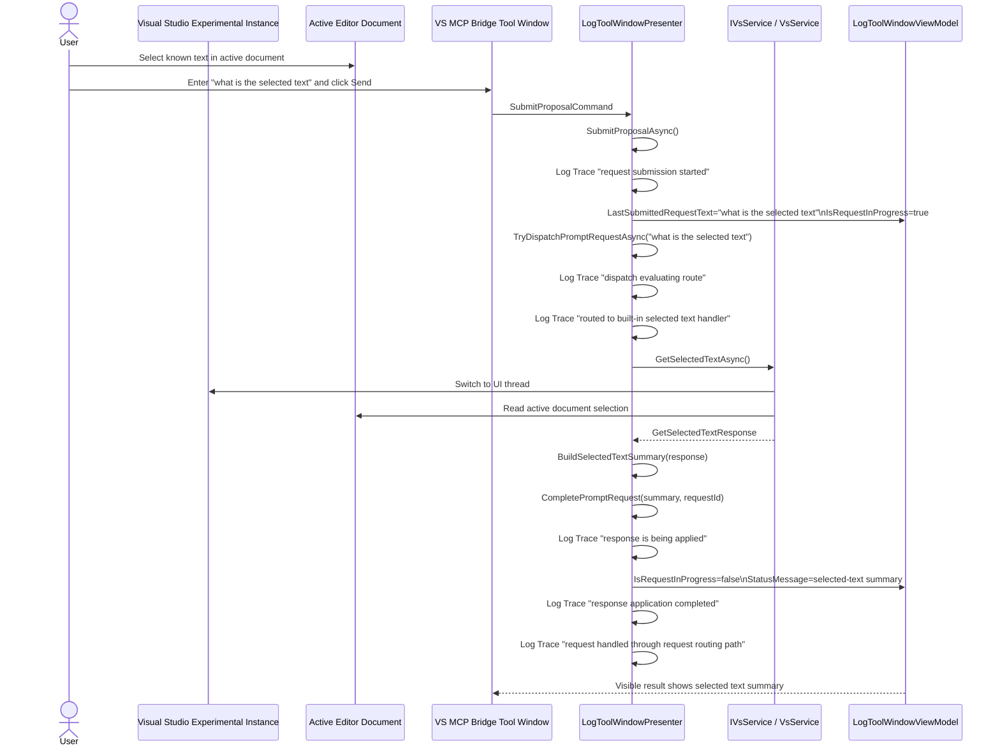

# VSIX Host Selected-Text Trace Workflow

Use this workflow to repeat the observed end-to-end selected-text validation against the VSIX host running inside the Visual Studio Experimental Instance, capture durable artifacts, and compare the resulting sequence against the current code.

## Purpose

Provide a repeatable AI-friendly and developer-friendly process for:

- launching the Experimental Instance with VSIX Trace logging enabled
- preparing a real editor selection in a known document
- exercising the live VS MCP Bridge tool window with `what is the selected text`
- collecting the visible result and correlated logs
- generating a Mermaid sequence diagram from observed behavior
- comparing the observed sequence to the current VSIX code path
- producing durable artifacts that can be reused in later sessions and future developer-facing explanations

## Scope

This workflow documents the VSIX-host built-in prompt path for selected text.

It is intentionally separate from:

- `SolutionFolder/docs/vsix-host-ping-trace-workflow.md`, which validates chat request routing
- MCP-client validation of `vs_get_selected_text`, which validates the pipe-backed MCP tool path

The prompt-box selected-text path should call the shared presenter built-in route and then the VSIX `IVsService.GetSelectedTextAsync` implementation. It should not route through the chat provider.

## Observed Baseline Run

This workflow was manually validated on:

- date: `2026-05-09`
- branch: `feature/approval-apply-ui-slice`
- commit at artifact creation: `12b4cbf`
- host: `VsMcpBridge.Vsix` in the Experimental Instance
- prompt: `what is the selected text`
- VS service operation: `GetSelectedText`
- operation id: `ce4e2bba4e324963932b1ba7e8a6c20c`
- elapsed time: `18 ms`
- selected file: `Y:\vs-mcp-bridge\VsMcpBridge.Vsix\Services\ProposalFilePicker.cs`
- selection length: `208`
- interaction mode: manual validation against the live VS MCP Bridge tool window

Reference artifacts from this baseline run:

- sequence diagram: [`SolutionFolder/docs/diagrams/vsix-host-selected-text-trace-20260509.mmd`](diagrams/vsix-host-selected-text-trace-20260509.mmd)
- observed log artifact: [`SolutionFolder/artifacts/logs/vsix-host-selected-text-trace-20260509.log`](../artifacts/logs/vsix-host-selected-text-trace-20260509.log)
- run metadata: [`SolutionFolder/artifacts/logs/vsix-host-selected-text-trace-20260509.metadata.json`](../artifacts/logs/vsix-host-selected-text-trace-20260509.metadata.json)
- session handoff: [`SolutionFolder/docs/session-handoffs/2026-05-09-selected-text-validation.md`](session-handoffs/2026-05-09-selected-text-validation.md)

## Preconditions

- repository root: `Y:\vs-mcp-bridge`
- branch should be recorded before the run
- current tests should pass before manual validation, especially:

```powershell
dotnet test .\VsMcpBridge.Shared.Tests\VsMcpBridge.Shared.Tests.csproj
```

- launch the Experimental Instance with:
  - `VSMCPBRIDGE_VsMcpBridge__Logging__Provider = StdErr`
  - `VSMCPBRIDGE_VsMcpBridge__Logging__MinimumLevel = Trace`
- open a real text document in the editor
- select a short, distinctive text value that can be recognized in the visible response and logs

Avoid selecting secrets or sensitive content because the selected text may appear in the visible result and captured artifacts.

## Run Procedure

### 1. Launch the Experimental Instance

From a PowerShell session rooted at the repository:

```powershell
Set-Location 'Y:\vs-mcp-bridge'
$env:VSMCPBRIDGE_VsMcpBridge__Logging__Provider = 'StdErr'
$env:VSMCPBRIDGE_VsMcpBridge__Logging__MinimumLevel = 'Trace'
Start-Process devenv.exe '/RootSuffix Exp Y:\vs-mcp-bridge\VsMcpBridge.slnx'
```

Expected startup evidence:

- the Experimental Instance opens on the solution
- the `VS MCP Bridge` tool window becomes visible or can be opened
- the tool window log surface contains initialization lines

### 2. Prepare a known editor selection

In the Experimental Instance:

1. open a real text/code file from the solution
2. select a short, distinctive text value such as a method name or test sentinel string
3. keep the editor document active while moving to the VS MCP Bridge tool window

Record:

- file path or project-relative file name
- selected text value
- whether the selected text was single-line or multi-line

### 3. Exercise the prompt surface

In the VS MCP Bridge tool window:

1. enter `what is the selected text` in the request input box
2. click `Send`
3. wait for the request to settle and the visible result surface to update

Expected visible results:

- the last submitted request shows `what is the selected text`
- the visible result surface contains the selected text, or an explicit `No selected text` message if the selection was lost
- the log panel shows correlated presenter and VS service entries with the same `RequestId` when available
- the prompt should not be routed to the chat provider

### 4. Capture artifacts

Copy or save the following:

- UI log text from the tool window log surface
- visible request/result values
- selected file and selected text metadata
- effective runtime configuration snapshot for logging settings
- branch and commit information

Suggested durable outputs:

- `SolutionFolder/artifacts/logs/<run-name>.log` for trimmed observed logs
- `SolutionFolder/artifacts/logs/<run-name>.metadata.json` for environment and config metadata
- `SolutionFolder/docs/diagrams/<run-name>.mmd` for the Mermaid sequence
- `SolutionFolder/docs/blog-drafts/<run-name>.md` for a short developer-facing explanation when the run establishes or updates durable understanding

Recommended run name format:

- `vsix-host-selected-text-trace-YYYYMMDD`

## Expected Log Pattern

For the VSIX-host selected-text prompt path, the expected sequence is:

1. `Prompt-box request submission started`
2. `Prompt-box request dispatch evaluating route`
3. `Prompt-box request routed to built-in selected text handler`
4. `Running VS service operation 'GetSelectedText'`
5. `VS service operation 'GetSelectedText' completed`
6. `Prompt-box response is being applied to the visible UI state`
7. `Prompt-box response application completed`
8. `Prompt-box request handled through request routing path`

Every presenter line in the observed request flow should carry the same correlation id.

If the selected text request routes to `IChatRequestService`, treat that as a routing bug.

If the request routes correctly but returns `No selected text`, first confirm whether Visual Studio cleared the editor selection when focus moved to the tool window. If the selection is still visible in the editor, compare the observed logs against `VsService.GetSelectedTextAsync`.

## Mermaid Generation Pattern

Build the Mermaid sequence from the observed logs, not from memory.

Use this template and replace the participants or labels only when the observed path differs:



## Code Comparison Checklist

After generating the sequence, compare it to the current code.

### Presenter checkpoints

Confirm these methods still match the observed order:

- `LogToolWindowPresenter.SubmitProposalAsync`
- `LogToolWindowPresenter.TryDispatchPromptRequestAsync`
- `LogToolWindowPresenter.BuildSelectedTextSummary`
- `LogToolWindowPresenter.CompletePromptRequest`

Specific expectations:

- a request id is created before routing
- the selected-text prompt is handled as a built-in prompt
- the selected-text prompt does not route through `IChatRequestService.SendAsync`
- the presenter applies the response to `StatusMessage`

### VSIX selected-text checkpoints

Confirm `VsService.GetSelectedTextAsync` still matches the observed host behavior:

- the operation switches to the UI thread before accessing Visual Studio services
- the active document is resolved
- the current editor selection is read
- empty selection and missing document cases return explicit non-throwing responses
- operation start/completion/failure logs are present at the appropriate level

### Accuracy rule

If the observed logs and code disagree, treat the logs as the observed runtime truth for that run and record the mismatch explicitly.

## Known Limitations

- Visual Studio may clear or alter editor selection depending on focus behavior. Record whether the selection remains visible after clicking into the tool window.
- This workflow validates the VSIX prompt-box built-in route, not the MCP `vs_get_selected_text` tool.
- If UI automation is used instead of a human click, note that the runtime behavior is still valid but the operator interaction was simulated.

## Reuse Guidance For Future Sessions

When repeating this workflow:

1. do not overwrite prior artifacts; create a new dated file set
2. record branch, commit, selected file, selected text, and whether the interaction was manual or automated
3. store the Mermaid diagram and observed logs together
4. update the handoff if the run changes the recommended next slice or reveals a mismatch between logs and code
