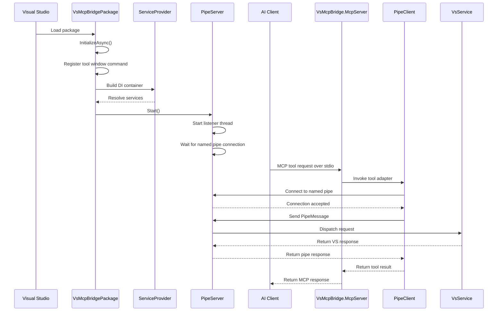

# VS MCP Bridge Diagram Notes

This document captures the current diagram guidance for the bootstrap flow discussed in the first blog entry.

## Purpose

The goal is to keep architecture visuals streamlined and comprehensive without turning diagram maintenance into its own project.

For this repo, the recommended split is:

- Use **Enterprise Architect** for canonical diagrams you intend to extend over time.
- Use **Mermaid** for fast drafts, discussion, and lightweight documentation.

## Recommended First Diagram

**Diagram name**

`VS MCP Bridge - Bootstrap To First Tool Call`

**Diagram type**

`Sequence Diagram`

## Enterprise Architect Sequence Diagram Spec

### Lifelines

1. `Visual Studio`
2. `VsMcpBridgePackage`
3. `ServiceProvider`
4. `PipeServer`
5. `Tool Window`
6. `AI Client`
7. `VsMcpBridge.McpServer`
8. `PipeClient`
9. `VsService`

If you want an even simpler version, `ServiceProvider` can be omitted. It is included here because the composition step is part of why the startup flow feels opaque.

### Main Success Flow

1. `Visual Studio -> VsMcpBridgePackage`  
   `Load package (solution exists)`
2. `VsMcpBridgePackage -> VsMcpBridgePackage`  
   `InitializeAsync()`
3. `VsMcpBridgePackage -> VsMcpBridgePackage`  
   `Register ShowLogToolWindowCommand`
4. `VsMcpBridgePackage -> ServiceProvider`  
   `Build DI container`
5. `ServiceProvider --> VsMcpBridgePackage`  
   `Resolve services`
6. `VsMcpBridgePackage -> PipeServer`  
   `Start()`
7. `PipeServer -> PipeServer`  
   `Start listener thread`
8. `PipeServer -> PipeServer`  
   `Wait for named pipe connection`
9. `AI Client -> VsMcpBridge.McpServer`  
   `Send MCP tool request over stdio`
10. `VsMcpBridge.McpServer -> PipeClient`  
    `Invoke VS tool adapter`
11. `PipeClient -> PipeServer`  
    `Connect to named pipe`
12. `PipeServer --> PipeClient`  
    `Connection accepted`
13. `PipeClient -> PipeServer`  
    `Send PipeMessage`
14. `PipeServer -> VsService`  
    `Dispatch request`
15. `VsService --> PipeServer`  
    `Return VS response`
16. `PipeServer --> PipeClient`  
    `Return pipe response`
17. `PipeClient --> VsMcpBridge.McpServer`  
    `Return tool result`
18. `VsMcpBridge.McpServer --> AI Client`  
    `Return MCP response`

### Optional Secondary Flow

Add this as an `opt` or `alt` fragment if you want to capture the edit approval path.

**Condition**

`If tool call is vs_propose_text_edit`

**Messages inside the fragment**

1. `VsService -> Tool Window`  
   `Show approval prompt`
2. `Tool Window -> Tool Window`  
   `Wait for user approve/reject`
3. `Tool Window --> VsService`  
   `Approval decision`

You do not need to model edit application yet unless you want the diagram to go beyond the first tool call.

### Suggested Notes

Add a note near `PipeServer`:

`VSIX is listening on named pipe before the tool window is opened.`

Add a note near `VsMcpBridge.McpServer`:

`MCP server waits on stdio as a separate process.`

Add a note near the overall diagram:

`Prompt submission occurs in the AI client. The bridge becomes active only when a tool call is made.`

## Mermaid Overview

Mermaid is a text-based diagram language. You write a small block of plain text describing a flow, sequence, graph, or state machine, and a renderer turns it into a diagram.

A useful mental model is:

- **Mermaid = fast drafting and documentation**
- **Enterprise Architect = durable architecture record**

### Why Mermaid is useful

- It is fast to create and revise.
- It works well in source control.
- It is easy for AI to generate.
- It is useful for lightweight architecture discussions.
- It is a good way to prototype diagrams before promoting them into Enterprise Architect.

### How Mermaid and Enterprise Architect fit together

Use Mermaid when you want speed.
Use Enterprise Architect when you want a long-lived diagram that you will extend over time.

The recommended workflow is:

1. Draft the diagram quickly in Mermaid.
2. If the diagram becomes important, build or refine the canonical version in Enterprise Architect.
3. Reuse the EA conventions as the house style for later Mermaid drafts.

## Mermaid Source

The same sequence diagram can be expressed in Mermaid like this:

If your Markdown renderer does not support Mermaid blocks, use the separate Mermaid file in `docs` and keep this Markdown document as the explanatory guide.

## Recommended Next Step

Build the first canonical sequence diagram in Enterprise Architect using the spec above.
After that, use the Mermaid file as a lightweight draft format for future diagrams.
