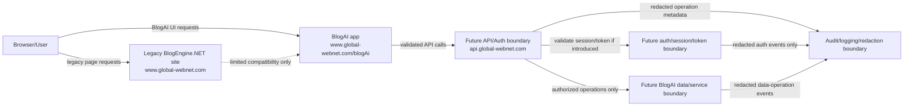

# BlogAI Auth Trust-Boundary Flow

## Purpose

Sketch the future BlogAI authentication and API trust boundaries before any implementation exists.

This document is conceptual direction only. It does not approve or implement authentication, OAuth/OpenID, `api.global-webnet.com`, new projects, deployment changes, BlogEngine.NET runtime changes, or production secret storage.

## Boundary Sketch

## Trust Boundaries

### Browser Boundary

The browser is untrusted input.

BlogAI and any future API must validate requests, origins, sessions, tokens, payloads, and intent. Client-side state, page chrome, hidden fields, route parameters, cookies, and local storage are not authority by themselves.

### Legacy App Boundary

The legacy BlogEngine.NET site remains the stable site at `https://www.global-webnet.com`.

BlogAI may coexist beside it under `/blogAi`, but BlogAI should not blindly trust legacy page chrome, widget output, cached content, or legacy route context as proof of identity, authorization, or current source of truth.

Legacy auth may be useful for compatibility or an adapter phase, but the legacy app should not own long-term BlogAI auth decisions by default.

### BlogAI App Boundary

The BlogAI app is a browser-facing application boundary, not an authority boundary by itself.

It may collect user intent and call a future API, but protected operations should be decided server-side. BlogAI UI code should not embed production secrets, trust client claims, or perform privileged operations without server validation.

### API/Auth Boundary

`https://api.global-webnet.com` is a possible future owned boundary for BlogAI API and auth-related decisions.

If introduced, it should validate all client claims before use, enforce policy, record audit-relevant operations, and isolate BlogAI-specific API behavior from legacy page rendering. It should not inherit trust from the browser or legacy page context without explicit validation.

### Downstream Data Boundary

Future BlogAI data or service dependencies are separate trust zones.

The API boundary should mediate access to content stores, cache operations, publishing operations, administrative actions, and any later BlogAI-specific data services. Downstream operations should receive only the minimum required authority and should return structured failures instead of leaking implementation details.

### Audit/Logging Boundary

Audit and logging are observability boundaries, not secret stores.

They should capture redacted operation metadata, correlation ids, capability/policy labels where safe, outcomes, elapsed timing, and failure categories. They must not capture raw credentials, tokens, session cookies, secret values, or full request/response bodies that could contain secrets.

## Component Trust Rules

- Browser/User: trusted only for user intent after validation; never trusted for authority by itself.
- Legacy BlogEngine.NET site: trusted for existing legacy behavior, not for long-term BlogAI identity or authorization ownership.
- BlogAI app under `/blogAi`: trusted as UI code only; it should not own privileged decisions or store production secrets.
- `api.global-webnet.com`: if built later, trusted only after explicit design to validate requests, enforce policy, and mediate protected operations.
- Future auth/session/token boundary: trusted only for explicitly documented validation results, not raw token contents in logs or prompts.
- Future BlogAI data/service boundary: trusted only behind API-side policy and operation checks.
- Audit/logging boundary: trusted for redacted evidence, never for secret persistence.

## Alignment With MCP Security Seams

The same vocabulary used in the MCP platform should guide BlogAI auth/API design:

- approval: sensitive operations may require human or policy approval before execution
- capabilities: protected operations should declare the authority they require
- secret indirection: components should refer to secrets without moving raw values through normal logs, prompts, or durable artifacts
- audit: meaningful operations should leave enough redacted evidence to reconstruct what happened
- redaction: tokens, credentials, and secret-like fields must be removed before durable logging
- observability: request and operation correlation should survive boundary crossings
- policy: authorization should be explicit and testable rather than incidental

These are boundary principles, not an instruction to implement the MCP security stack inside BlogAI.

## Deferred

Explicitly deferred:

- identity model
- OAuth/OpenID
- refresh tokens
- user, role, RBAC, tenant, or organization model
- social login
- external identity provider integration
- API gateway
- production secret store
- deployment decisions
- certificate decisions
- `api.global-webnet.com` project or service creation
- BlogEngine.NET runtime modification
- cache-clear, publish, or deployment automation

## First Implementation Still Deferred

This slice only sketches future boundaries.

No auth implementation is approved here. The next useful step remains documentation: define concrete auth flows, trust boundaries, callers, protected operations, secrets, audit events, and failure modes. Only after that boundary is explicit should a minimal local authentication prototype be considered.
