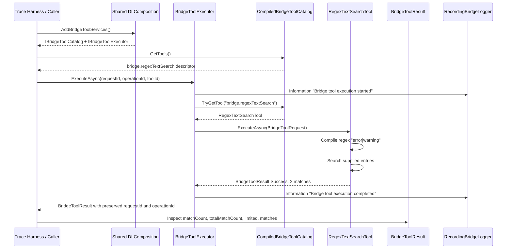

# Bridge Tool Execution Trace Workflow

Use this workflow to repeat the observed bridge tool execution validation, capture durable artifacts, and compare the resulting sequence against the current shared tool code.

## Purpose

Provide a repeatable AI-friendly and developer-friendly process for:

- invoking a compiled bridge tool through `IBridgeToolExecutor`
- proving catalog discovery through `CompiledBridgeToolCatalog`
- collecting correlated execution-boundary logs
- preserving request and operation correlation IDs
- generating a Mermaid sequence diagram from observed behavior
- producing durable artifacts future sessions can use for triage before expanding into MEF, plugin loading, or search ranking

## Scope

This workflow documents the shared compiled bridge tool path only.

It does not validate:

- MEF discovery
- directory-loaded plugins
- BM25 or ranked search
- MCP stdio transport
- named-pipe transport
- presenter, proposal, or Visual Studio service behavior

## Observed Baseline Run

This workflow was validated with a temporary console harness that used the production shared DI/tool services:

- run name: `tool-regex-search-trace-20260509`
- branch: `main`
- commit: `85401fd`
- catalog: `CompiledBridgeToolCatalog`
- executor: `BridgeToolExecutor`
- tool: `bridge.regexTextSearch`
- request id: `tool-trace-20260509-req-001`
- operation id: `tool-regex-search-20260509-op-001`
- pattern: `error|warning`
- case sensitive: `false`
- max results: `10`
- observed result: success, 2 returned matches, 2 total matches

Reference artifacts:

- sequence diagram: [`docs/diagrams/tool-regex-search-trace-20260509.mmd`](diagrams/tool-regex-search-trace-20260509.mmd)
- observed log transcript: [`artifacts/logs/tool-regex-search-trace-20260509.log`](../artifacts/logs/tool-regex-search-trace-20260509.log)
- run metadata: [`artifacts/logs/tool-regex-search-trace-20260509.metadata.json`](../artifacts/logs/tool-regex-search-trace-20260509.metadata.json)
- session handoff: [`docs/session-handoffs/2026-05-09-tool-execution-validation.md`](session-handoffs/2026-05-09-tool-execution-validation.md)

## Preconditions

- repository root: `Y:\vs-mcp-bridge`
- branch and commit should be recorded before the run
- current shared tests should pass:

```powershell
dotnet test .\VsMcpBridge.Shared.Tests\VsMcpBridge.Shared.Tests.csproj
```

- tool execution should use `AddBridgeToolServices()` so the catalog/executor path matches shared composition
- use a deterministic request id and operation id in the trace harness

## Run Procedure

### 1. Create a small trace harness

Use a temporary console app outside the repository, or an equivalent test harness, that references:

- `VsMcpBridge.Shared`
- `Microsoft.Extensions.DependencyInjection`
- `Microsoft.Extensions.Logging`
- `VsMcpBridge.Shared.Composition`
- `VsMcpBridge.Shared.Loggers`
- `VsMcpBridge.Shared.Tools`

The harness should:

1. create a `RecordingBridgeLogger`
2. register it as `ILogger`
3. call `services.AddBridgeToolServices()`
4. resolve `IBridgeToolCatalog`
5. resolve `IBridgeToolExecutor`
6. create a `BridgeToolRequest` for `RegexTextSearchTool.ToolId`
7. execute through `IBridgeToolExecutor.ExecuteAsync`
8. print catalog descriptors, logger entries, result metadata, and returned matches

### 2. Use deterministic request input

Baseline input:

```text
ToolId: bridge.regexTextSearch
RequestId: tool-trace-20260509-req-001
OperationId: tool-regex-search-20260509-op-001
pattern: error|warning
caseSensitive: false
maxResults: 10
entries:
- Info: startup complete
- Warning: configuration fallback used
- Error: sample failure marker
- Trace: execution complete
```

Expected result:

- `Success=True`
- `matchCount=2`
- `totalMatchCount=2`
- `limited=False`
- returned values include `Warning` and `Error`

### 3. Capture correlated logs

The executor boundary must produce at least:

```text
Bridge tool execution started [ToolId=bridge.regexTextSearch] [RequestId=tool-trace-20260509-req-001] [OperationId=tool-regex-search-20260509-op-001].
Bridge tool execution completed [ToolId=bridge.regexTextSearch] [RequestId=tool-trace-20260509-req-001] [OperationId=tool-regex-search-20260509-op-001] [Success=True] [ElapsedMs=<n>].
```

Every line in the observed execution boundary should preserve the same request id and operation id.

For failure-path traces, capture:

- `ErrorCode`
- failure message
- exception type if one was logged
- whether the failure was structured by the tool or caught by `BridgeToolExecutor`

### 4. Preserve durable artifacts

For each new run, create dated files instead of overwriting existing artifacts:

- `artifacts/logs/<run-name>.log`
- `artifacts/logs/<run-name>.metadata.json`
- `docs/diagrams/<run-name>.mmd`
- optionally `docs/session-handoffs/<date>-<topic>.md` when the run changes the resume point

Metadata should include:

- branch
- commit
- tool id
- request id
- operation id
- input summary
- observed result summary
- capture method
- explicit scope exclusions

If `.gitignore` blocks the files, whitelist the exact durable artifact paths.

## Mermaid Generation Pattern

Build the Mermaid sequence from observed logs and result output, not from the intended design alone.

Use this baseline shape for the compiled regex text-search path:



## Code Comparison Checklist

After generating the sequence, compare it to current code.

Confirm:

- `AddBridgeToolServices` registers `RegexTextSearchTool` as compiled `IBridgeTool`
- `CompiledBridgeToolCatalog.GetTools()` exposes the descriptor
- `BridgeToolExecutor.ExecuteAsync` logs start before catalog lookup
- `BridgeToolExecutor.ExecuteAsync` preserves request id and operation id in all returned results
- `RegexTextSearchTool.ExecuteAsync` returns structured failure for invalid regex
- no MEF, plugin directory, BM25, MCP transport, presenter, or proposal code is involved in this workflow

## Reuse Guidance For Future Sessions

When repeating this workflow:

1. use deterministic request and operation IDs
2. capture the catalog descriptor before execution
3. capture executor boundary logs and final result data
4. generate the Mermaid diagram from observed output
5. compare the diagram against code before expanding the tool system
6. keep future MEF/plugin/BM25 traces separate from this compiled-tool baseline
